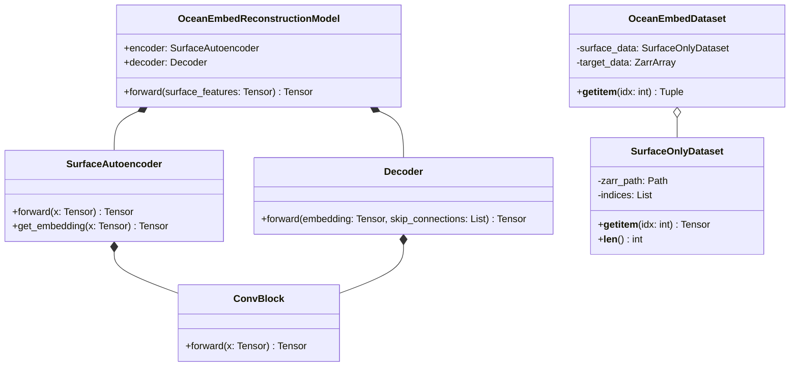
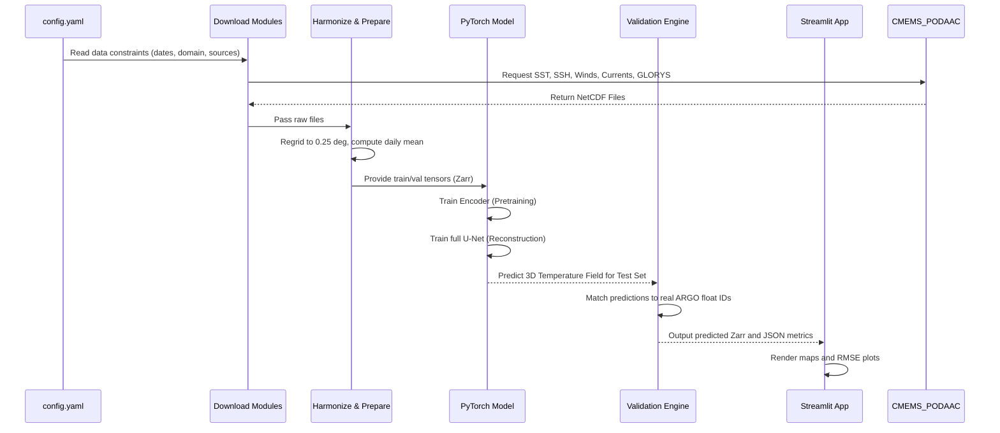

# OceanEmbed: Project Documentation

## 1. Problem Statement
Monitoring and understanding the subsurface ocean environment is critical for climate modeling, marine ecosystem preservation, and extreme weather forecasting. However, collecting direct measurements of depth-resolved ocean properties (like subsurface temperature profiles) is highly expensive and relies on sparse in-situ sensors such as ARGO floats. 

**The core problem we face is:** How can we accurately estimate continuous, high-resolution, depth-resolved ocean temperature fields across large domains using only readily available satellite-derived ocean surface observations?

## 2. Our Solution: OceanEmbed
**OceanEmbed** is an end-to-end Machine Learning pipeline that leverages a spatial representation of daily ocean surface observations to reconstruct a depth-resolved temperature field (from 0 to 1000 meters across 15 depth levels).

The solution utilizes a **Convolutional Neural Network (CNN) encoder-decoder architecture (U-Net style)**:
- **Inputs (Surface Observations):** Satellite-derived daily measurements including Sea Surface Temperature (SST), Sea Surface Height (SSH), Sea Surface Salinity (SSS), Surface Winds (U and V), and Ocean Currents (U and V).
- **Harmonization Pipeline:** Automatically downloads from CMEMS and PO.DAAC, harmonizes temporal frequencies to daily means, regrids to a uniform 0.25-degree spatial resolution, and applies a shared land/ocean mask.
- **Model:** A CNN `OceanEmbedReconstructionModel` featuring a `SurfaceAutoencoder` (for pretraining embeddings) and a mirrored decoder that maps 2D surface representations into 3D subsurface temperature profiles.
- **Validation:** Independent validation against real-world, in-situ ARGO float profiles (`PLATFORM_NUMBER`-tracked) to ensure the model's accuracy reflects true oceanic conditions rather than just overfitting to reanalysis data (GLORYS).

## 3. Challenges Faced During Implementation
While building OceanEmbed, we encountered and solved several complex challenges:
- **Data Harmonization & Alignment:** Raw satellite and reanalysis data from CMEMS and PO.DAAC come in different coordinate reference systems, resolutions, and update frequencies. We had to build a robust preprocessing engine to temporally and spatially align these datasets, handling NaN values (landmasses) by setting a unified shared mask and zero-filling standardized tensors.
- **Data Leakage in Spatiotemporal Models:** Time-series spatial data is highly prone to data leakage. We solved this by strictly splitting the data temporally (train: up to Nov 2023, val/test: Dec 2023 - Jan 2024) and segregating ARGO float validation by `PLATFORM_NUMBER` so that a float seen in training is never used in testing.
- **High Dimensionality and Compute Limits:** Predicting 15 depth channels over a large spatial grid (Arabian Sea and Bay of Bengal) is memory-intensive. We optimized this using Zarr arrays for fast out-of-core slicing and deployed depth-weighted loss functions to account for lower temperature variances in the deep ocean compared to the surface.
- **Unit and Baseline Consistency:** Ensuring physical realism was challenging. We incorporated robust test suites (`test_depth_channel_and_units.py`) to verify that outputs maintain physical Celsius boundaries and compare predictions against a climatology baseline to prove ML skill.

## 4. System Architecture and Data Flow

### System Architecture
The system is built as a modular data pipeline and PyTorch modeling framework:
1. **Data Ingestion Layer:** Interfaces with Copernicus Marine (CMEMS) and NASA PO.DAAC APIs.
2. **Preprocessing & Harmonization Layer:** NetCDF processor that outputs chunked Zarr stores (`oceanembed.zarr`, `target_temperature.zarr`).
3. **Modeling Engine:** PyTorch-based U-Net architecture.
4. **Validation & Dashboard Layer:** A Streamlit interactive dashboard (`app.py`) for visual validation and a metrics engine outputting JSON/CSV reports.

### Data Flow
```mermaid
flowchart TD
    Config[config.yaml\npaths, dates, domain, depths] --> DataIn[00 Access\nCMEMS / PO.DAAC]
    DataIn --> Raw[data/raw\nNetCDF files]
    
    Raw --> Harmonize[01 Harmonize\nregrid, daily mean, shared mask]
    Harmonize --> SurfZarr[Surface Zarr Cube\n(time, lat, lon)]
    
    Raw --> TargetPrep[GLORYS target preparation]
    TargetPrep --> TargetZarr[target_temperature.zarr\n(time, depth, lat, lon)]
    
    Raw --> ArgoPrep[ARGO preparation]
    ArgoPrep --> ArgoCSV[ARGO validation CSV\nfloat-level split]
    
    SurfZarr --> Splits[03 Splits + Train-only Normalization]
    TargetZarr --> Splits
    
    Splits --> Pretrain[04 Embedding Pretraining\nSurfaceAutoencoder]
    Splits --> Train[05 Reconstruction Training\nOceanEmbedReconstructionModel]
    
    Train --> Test[06 Test Predictions]
    Test --> ArgoCSV
    Test --> Dashboard[07 Streamlit Dashboard UI]
```

## 5. Class Diagram (Core ML Components)


## 6. Sequence Diagram (Pipeline Execution)


## 7. Research and Information
- **Domain Focus:** Currently scoped to the Arabian Sea and Bay of Bengal (Bounding Box: 5°N-30°N, 45°E-105°E).
- **Depth Range:** 0 to 1000 meters mapped across 15 distinct depth levels (0, 5, 10, 20, 30, 50, 75, 100, 125, 150, 200, 300, 500, 700, 1000m).
- **Data Sources:**
  - **SST:** METOFFICE-GLO-SST-L4-REP-OBS-SST (CMEMS)
  - **SSH:** cmems_obs-sl_glo_phy-ssh_my_allsat-l4-duacs-0.125deg_P1D
  - **SSS:** cmems_obs-mob_glo_phy-sss_my_multi_P1D
  - **Winds:** CCMP_WINDS_10M6HR_L4_V3.1 (PO.DAAC)
  - **Currents:** OSCAR_L4_OC_NRT_V2.0 (PO.DAAC)
  - **Ground Truth Targets (Training):** GLORYS12V1 (cmems_mod_glo_phy_my_0.083deg_P1D-m)
  - **Validation Truth:** In-situ ARGO Floats.
- **Evaluation Metrics:** Evaluated against baseline Climatology. Primary metrics include RMSE, spatial/temporal tolerance matching (depth tolerance 10m, spatial 0.5 deg, time 1 day), and Taylor diagrams to assess variance and correlation against physical observations.
